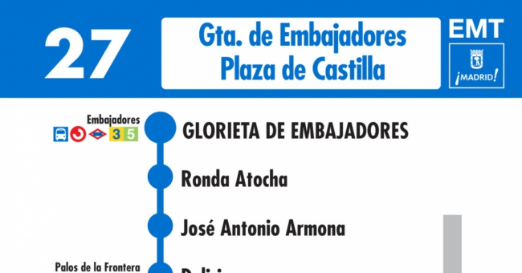
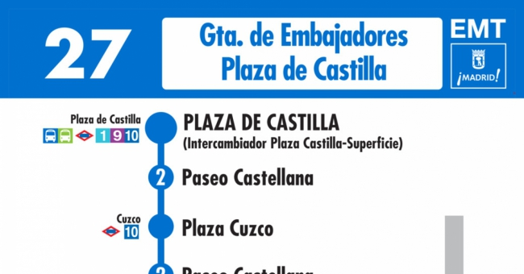

# LINE 27, BUS SERVICE, MADRID, SPAIN

    

# LINE 27 ROUTE: EMBAJADORES - PLAZA DE CASTILLA 
Embajadores - 86

Teatro Circo Price - 85

José Antonio Armona - 87

Calle de las Delicias - 88
Delicias-Atocha - 89
Prado-Atocha - 82
Museo del Prado-Jardín Botánico - 5511
Neptuno - 78
Cibeles - 5443
Cibeles - 72
Recoletos - 65
Colón - 66
Castellana-Ministerio Interior - 62
Castellana-Rubén Darío - 60
Emilio Castelar - 5333
Gregorio Marañón - 56
Museo Ciencias Naturales - 54
Nuevos Ministerios-Castellana - 52
Nuevos Ministerios-Centro Comercial - 50
AZCA - 47
Lima-Santiago Bernabéu - 42
Santiago Bernabéu - 44
Castellana-Rafael Salgado - 39
Castellana-San Germán - 37
Cuzco - 35
Castellana-Rosario Pino - 33
Juzgados Plaza Castilla - 29
Plaza Castilla - 5602

# LINE 27 ROUTE: PLAZA DE CASTILLA - EMBAJADORES

Plaza Castilla - 5602
Juzgados Plaza Castilla - 28
Castellana-Rosario Pino - 32
Cuzco - 34
Castellana-San Germán - 36
Castellana-Rafael Salgado - 38
Lima-Santiago Bernabéu - 41
AZCA - 46
Nuevos Ministerios-Centro Comercial - 48
Nuevos Ministerios-Cercanías - 49
Nuevos Ministerios-Castellana - 51
Museo Ciencias Naturales - 53
Gregorio Marañón - 4337
Emilio Castelar - 57
Castellana-Rubén Darío - 59
Castellana-Ministerio Interior - 61
Colón - 63
Recoletos - 5626
Recoletos-Barbara de Braganza - 68
Cibeles - 73
Banco de España - 76
Neptuno - 77
Museo del Prado-Jardín Botánico - 79
Prado-Atocha - 81
Reina Sofía - 83
Teatro Circo Price - 84
Embajadores - 86

